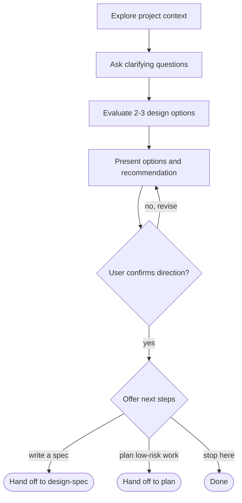

# Brainstorming

Help the user think through underdefined or tradeoff-heavy ideas without forcing a durable artifact.

Use this skill when the direction is not settled, when meaningful design trade-offs need to be surfaced, or when the user wants a quick collaborative brainstorm. If the user asks for a written, saved, reviewed, or approved spec, use `design-spec` instead. If the implementation direction is already clear and no design exploration is needed, use `plan` instead.

The default output is lightweight: clarified goals, 2-3 meaningful options, a recommendation, a decision summary, or a next-step suggestion. Do not create a spec file unless the user explicitly asks to move into the `design-spec` workflow.

## Boundaries

- Do not invoke `plan`, write implementation code, scaffold a project, or take implementation action during the brainstorm.
- Do not save a durable spec, generate references, dispatch a spec reviewer, or require a user review gate. Those belong to `design-spec`.
- If the conversation reveals that the decision is too important or complex to keep informal, recommend switching to `design-spec` and explain why.
- Do not transition to `plan` automatically. Planning is an opt-in next step after the user confirms the direction.

## Checklist

You need to follow each of these items and complete them in order:

1. Explore project context: check relevant files, docs, and recent commits as needed for the decision
2. Ask clarifying questions: one at a time, understand goals, constraints, success criteria, and risks
3. Evaluate meaningful design options: present 2-3 viable options with balanced treatment, recommend one, and explain why it is preferred
4. Present and confirm: scale the depth to the complexity, confirm the chosen direction with the user, then offer next steps

## Process Flow

The default terminal state is stopping with a settled direction. Spec writing and planning are opt-in.

## Process

### Understand the Problem

- Scale context gathering to the risk of the decision. For codebase work, check relevant files, docs, and recent commits before proposing changes.
- If the request describes multiple independent subsystems, flag that early and help split the discussion into smaller topics.
- Ask focused clarifying questions one at a time when goals, constraints, success criteria, or risks are unclear.
- Prefer multiple choice questions when possible, but use open-ended questions when the user is still shaping the idea.

### Explore Options

- Present 2-3 viable options when meaningful trade-offs exist.
- Treat options fairly; do not make one option a strawman just to support the recommendation.
- Recommend one option when appropriate and explain why it fits the user's goals and constraints.
- If the solution space is genuinely narrow, say so plainly instead of inventing extra options.

### Shape the Decision

- Cover scope, risks, validation considerations, and non-goals at a depth that matches the decision.
- For quick brainstorming, keep the response compact and useful instead of turning it into a spec.
- If the user wants to preserve the decision, or the decision is high-risk, cross-cutting, or likely to be resumed later, offer to continue with `design-spec`.
- If the user confirms a direction and wants implementation planning for low-risk work that does not need a durable spec, transition to `plan`.

### Design for Isolation and Clarity

- Break proposed systems into smaller units with clear responsibilities and interfaces.
- For each unit, clarify what it does, how it is used, and what it depends on.
- If someone cannot understand what a unit does without reading its internals, the boundaries need work.

### Working in Existing Codebases

- Explore the current structure before proposing changes.
- Include targeted improvements only when existing problems affect the current goal.
- Do not propose unrelated refactoring.

## Next Steps

Once the user confirms the direction, summarize the settled design briefly and offer the next step. Default to stopping; do not run anything automatically.

> "Design settled. Want me to write a durable spec (`design-spec`), go straight to a plan for this low-risk work (`plan`), or stop here?"

- If the user wants a saved, reviewed spec, hand off to `design-spec`.
- If the user wants implementation planning and the work does not need a durable spec, hand off to `plan`.
- If the work is high-risk, cross-cutting, or likely to need review, recommend `design-spec` before `plan`.
- Otherwise, stop. The settled direction lives in the conversation.

## Key Principles

- Keep it lightweight: the default output is a conversation, not a file
- Ask one question at a time.
- Present options fairly and recommend clearly.
- Offer, do not force: artifacts and planning are opt-in next steps.
- State assumptions when moving quickly.
- Stay focused on the current decision.

## Diagrams

When visual explanation would help, use lightweight Mermaid diagrams directly in the conversation. Mermaid works well for architecture diagrams, flowcharts, and sequence diagrams. If a diagram is awkward to express in Mermaid, use an ASCII diagram instead.
