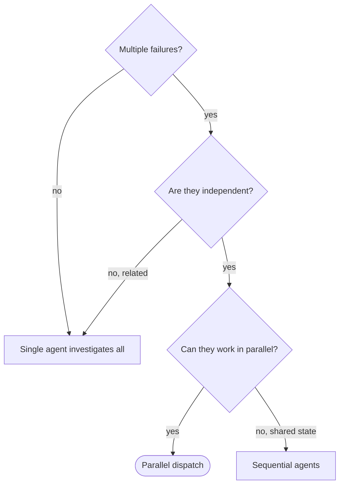

# Dispatching Parallel Agents

## Overview

Delegate tasks to specialized agents with isolated context. By precisely
crafting their instructions and context, you keep them focused and successful.
They should not inherit your full session history by default. Construct exactly
what they need, and preserve your own context for coordination work.

When you have multiple unrelated failures, different test files, different
subsystems, or different bugs, investigating them sequentially wastes time.
Each investigation can happen in parallel when the work is truly independent.

Core principle: dispatch one agent per independent problem domain and let them
work concurrently.

## When to Use



Use when:

- 3+ test files are failing with different root causes
- Multiple subsystems are broken independently
- Each problem can be understood without context from the others
- There is no shared state between investigations

Do not use when:

- Failures are related and fixing one might fix the others
- Understanding the problem requires full system state
- Agents would interfere with each other

## The Pattern

### 1. Identify Independent Domains

Group failures by what is broken:

- File A tests: tool approval flow
- File B tests: batch completion behavior
- File C tests: abort functionality

Each domain should be independent. Fixing tool approval should not affect abort
tests.

### 2. Create Focused Agent Tasks

Each agent gets:

- Specific scope: one test file or subsystem
- Clear goal: make those tests pass or resolve that problem
- Constraints: do not change unrelated code
- Expected output: summary of what was found and fixed

### 3. Dispatch in Parallel

Using your harness's subagent or delegation tool, start one agent per problem
domain and launch them concurrently when safe to do so.

```text
Agent 1
- Scope: Fix agent-tool-abort.test.ts failures

Agent 2
- Scope: Fix batch-completion-behavior.test.ts failures

Agent 3
- Scope: Fix tool-approval-race-conditions.test.ts failures
```

Give each agent only the context it needs. Avoid forwarding your full session
history unless the task genuinely depends on it.

### 4. Review and Integrate

When agents return:

- Read each summary
- Verify the fixes do not conflict
- Run the full test suite or equivalent verification
- Integrate all changes

## Agent Prompt Structure

Good agent prompts are:

1. Focused: one clear problem domain
2. Self-contained: all context needed to understand the problem
3. Specific about output: what the agent should return

```markdown
Fix the 3 failing tests in src/agents/agent-tool-abort.test.ts:

1. "should abort tool with partial output capture"
   - expects 'interrupted at' in message
2. "should handle mixed completed and aborted tools"
   - fast tool aborted instead of completed
3. "should properly track pendingToolCount" - expects 3 results but gets 0

These are timing or race condition issues. Your task:

1. Read the test file and understand what each test verifies
2. Identify the root cause, timing issues or actual bugs
3. Fix by:
   - Replacing arbitrary timeouts with event-based waiting
   - Fixing bugs in abort implementation if found
   - Adjusting test expectations if behavior legitimately changed

Do NOT just increase timeouts. Find the real issue.

Return: Summary of what you found and what you fixed.
```

## Common Mistakes

- Too broad: "Fix all the tests" so the agent gets lost
- Specific: "Fix agent-tool-abort.test.ts" keeps the scope focused
- No context: "Fix the race condition" without naming the file or failure
- Context included: paste the failing test names and the relevant error
  messages
- No constraints: the agent may refactor unrelated code
- Constraints included: "Do NOT change production code" or "Fix tests only"
- Vague output: "Fix it" gives you little to review
- Specific output: "Return summary of root cause and changes"

## When NOT to Use

Related failures, exploratory debugging, or shared-state edits usually belong in
one investigation, not many.

## Real Example

Scenario: 6 test failures across 3 files after major refactoring

Failures:

- `agent-tool-abort.test.ts`: 3 failures, timing issues
- `batch-completion-behavior.test.ts`: 2 failures, tools not executing
- `tool-approval-race-conditions.test.ts`: 1 failure, execution count is 0

Decision: these were independent domains, abort logic separate from batch
completion, separate from race conditions.

Dispatch:

- Agent 1: fix `agent-tool-abort.test.ts`
- Agent 2: fix `batch-completion-behavior.test.ts`
- Agent 3: fix `tool-approval-race-conditions.test.ts`

Results:

- Agent 1 replaced timeouts with event-based waiting
- Agent 2 fixed an event-structure bug
- Agent 3 added a wait for async tool execution to complete

Integration: all fixes were independent, there were no conflicts, and the full
suite went green.

Time saved: 3 problems solved in parallel instead of sequentially.

## Key Benefits

1. Parallelization: multiple investigations happen simultaneously
2. Focus: each agent has narrow scope and less context to track
3. Independence: agents do not interfere with each other
4. Speed: 3 problems can be solved in the time of 1

## Verification

After agents return:

1. Review each summary and understand what changed
2. Check for conflicts, especially overlapping file edits
3. Run the full suite or equivalent integration verification
4. Spot-check the result because agents can make systematic mistakes
