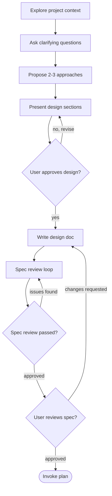

# Brainstorming

Help turn ideas into fully formed designs and specs through collaborative
dialogue.

Start by understanding the current project context, then ask questions one at a
time to refine the idea. Once you understand what you're building, present the
design and get user approval.

## Hard Gate

Do NOT invoke any implementation skill, write any code, scaffold any project,
or take any implementation action until you have presented a design and the
user has approved it. This applies to EVERY project regardless of perceived
simplicity.

## Anti-Pattern: "This Is Too Simple To Need A Design"

Every project goes through this process. A todo list, a single-function
utility, a config change, all of them. "Simple" projects are where unexamined
assumptions cause the most wasted work. The design can be short for truly
simple projects, but you MUST present it and get approval.

## Checklist

You MUST create a task for each of these items and complete them in order:

1. Explore project context: check files, docs, recent commits
2. Ask clarifying questions: one at a time, understand
   purpose, constraints, and success criteria
3. Propose 2-3 approaches: with trade-offs and your recommendation
4. Present design: in sections scaled to their complexity, get user
   approval after each section
5. Write design doc: save to `plans/spec-<slug>-YYYYMMDD.md` and commit
6. Spec review loop: dispatch a reviewer subagent using
   `references/spec-document-reviewer-prompt.md` with precisely crafted review
   context, never your session history; fix issues and re-dispatch until
   approved, max 5 iterations, then surface to a human
7. User reviews written spec: ask the user to review the spec file before
   proceeding
8. Transition to implementation: invoke `plan` to create the
   implementation plan

## Process Flow

The terminal state is invoking `plan`. Do NOT invoke any other
implementation skill directly from brainstorming.

## The Process

### Understanding the Idea

- Check out the current project state first: files, docs, recent commits
- Before asking detailed questions, assess scope. If the request describes
  multiple independent subsystems, flag this immediately.
- If the project is too large for a single spec, help the user decompose it
  into sub-projects. Each sub-project gets its own spec, plan, and
  implementation cycle.
- For appropriately scoped projects, ask questions one at a time to refine the
  idea.
- Prefer multiple choice questions when possible, but open-ended is fine too.
- Only one question per message. If a topic needs more exploration, break it
  into multiple questions.
- Focus on understanding purpose, constraints, and success criteria.

### Exploring Approaches

- Propose 2-3 different approaches with trade-offs.
- Present options conversationally with your recommendation and reasoning.
- Lead with your recommended option and explain why.

### Presenting the Design

- Once you believe you understand what you're building, present the design.
- Scale each section to its complexity: a few sentences if straightforward, up
  to 200-300 words if nuanced.
- Ask after each section whether it looks right so far.
- Cover architecture, components, data flow, error handling, and testing.
- Be ready to go back and clarify if something does not make sense.

### Design for Isolation and Clarity

- Break the system into smaller units that each have one clear purpose,
  communicate through well-defined interfaces, and can be understood and tested
  independently.
- For each unit, answer what it does, how it is used, and what it depends on.
- If someone cannot understand what a unit does without reading its internals,
  the boundaries need work.
- Smaller, well-bounded units are easier to reason about and safer to edit.

### Working in Existing Codebases

- Explore the current structure before proposing changes. Follow existing
  patterns.
- Where existing code has problems that affect the work, include targeted
  improvements as part of the design.
- Do not propose unrelated refactoring. Stay focused on the current goal.

## After the Design

### Documentation

- Write the validated design to `plans/spec-<slug>-YYYYMMDD.md`
- User preferences for the spec location override this default
- Commit the design document to git

### Spec Review Loop

After writing the spec document:

1. Dispatch a reviewer subagent using
   `references/spec-document-reviewer-prompt.md`
2. If issues are found, fix the spec, re-dispatch, and repeat until approved
3. If the loop exceeds 5 iterations, surface to a human for guidance

### User Review Gate

After the spec review loop passes, ask the user to review the written spec
before proceeding:

> "Spec written and committed to `<path>`. Please review it and let me know if
> you want to make any changes before we start writing out the implementation
> plan."

Wait for the user's response. If they request changes, make them and re-run the
spec review loop. Only proceed once the user approves.

### Implementation

- Invoke `plan` to create a detailed implementation plan
- Do NOT invoke any other implementation skill. `plan` is the next
  step.

## Key Principles

- One question at a time: do not overwhelm the user with multiple
  questions
- Multiple choice preferred: easier to answer than open-ended when possible
- YAGNI ruthlessly: remove unnecessary features from all designs
- Explore alternatives: always propose 2-3 approaches before settling
- Incremental validation: present the design and get approval before moving
  on
- Be flexible: go back and clarify when something does not make sense

## Diagrams

When visual explanation would help, use lightweight Mermaid diagrams directly in
the conversation or spec document. Mermaid works well for architecture diagrams,
flowcharts, and sequence diagrams, and it renders natively on GitHub. If a
diagram is awkward to express in Mermaid, use an ASCII diagram instead.
