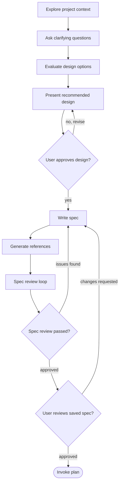

# Brainstorming

Help turn underdefined or tradeoff-heavy work into an approved design and a
durable spec artifact.

Use this skill when the direction is not settled or when meaningful design
trade-offs need to be surfaced. If the implementation direction is already
clear and the next step is execution planning, use `plan` instead.

Start by understanding the current project context, then ask focused questions
one at a time. Once you understand what should be built, present the
recommended design, mention viable alternatives and why they were not chosen,
then save the approved design as a spec under `spec/`.

## Hard Gate

Once this skill is active, do NOT invoke `plan`, write implementation code,
scaffold a project, or take implementation action until you have presented a
design and the user has approved it.

## Checklist

You MUST create a task for each of these items and complete them in order:

1. Explore project context: check files, docs, and recent commits
2. Ask clarifying questions: one at a time, understand goals, constraints,
   success criteria, and risks
3. Evaluate meaningful design options: recommend one choice, mention viable
   alternatives, and explain why they were not chosen
4. Present design: scale the depth to the complexity and get user approval
5. Write design spec: save to `spec/spec-<slug>-YYYYMMDD.md`
6. Invoke `reference-recorder` to generate a `## References` section
7. Spec review loop: dispatch a reviewer subagent using
   `references/spec-document-reviewer-prompt.md` with precisely crafted review
   context, never your session history; fix issues and re-dispatch until
   approved, max 5 iterations, then surface to a human
8. User reviews written spec: ask the user to review the saved spec file before
   proceeding
9. Transition to implementation: invoke `plan` to create the implementation
   plan

## Process Flow



The terminal state is invoking `plan`. Do NOT invoke any other implementation
skill directly from brainstorming.

## The Process

### Understanding the Problem

- Check out the current project state first: files, docs, recent commits
- Before asking detailed questions, assess scope. If the request describes
  multiple independent subsystems, flag this immediately
- If the project is too large for a single spec, help the user decompose it
  into sub-projects. Each sub-project gets its own spec, plan, and
  implementation cycle
- For appropriately scoped projects, ask questions one at a time to refine the
  idea
- Prefer multiple choice questions when possible, but open-ended is fine too
- Focus on understanding purpose, constraints, success criteria, and risks

### Evaluating Options

- Recommend one design choice and explain why it fits best
- Mention other viable options so the user understands the trade-offs
- Explain why each alternative was not chosen when that helps decision-making
- If there is no meaningful alternative, say so plainly instead of inventing
  extra options

### Presenting the Design

- Once you believe you understand what should be built, present the design
- Scale each section to its complexity: a few sentences if straightforward, up
  to 200-300 words if nuanced
- Ask after each section whether it looks right so far
- Cover the recommended design, alternatives considered, scope, risks, and
  validation considerations
- Be ready to go back and clarify if something does not make sense

### Design for Isolation and Clarity

- Break the system into smaller units that each have one clear purpose,
  communicate through well-defined interfaces, and can be understood and tested
  independently
- For each unit, answer what it does, how it is used, and what it depends on
- If someone cannot understand what a unit does without reading its internals,
  the boundaries need work
- Smaller, well-bounded units are easier to reason about and safer to edit

### Working in Existing Codebases

- Explore the current structure before proposing changes. Follow existing
  patterns
- Where existing code has problems that affect the work, include targeted
  improvements as part of the design
- Do not propose unrelated refactoring. Stay focused on the current goal

## Spec Structure

Save the approved design to `spec/spec-<slug>-YYYYMMDD.md`.

User preferences for the spec location override this default.

Do NOT commit the spec unless the user explicitly asks.

Every saved spec MUST include a `## References` section generated by invoking
the `reference-recorder` skill.

Use a structure like this and adapt the detail to the task:

````markdown
# [Feature Name] Design Spec

## Problem or Goal
[What problem this solves and why it matters]

## Context
[Relevant codebase, product, or operational context]

## Recommended Design
[The chosen design and why it is recommended]

## Alternatives Considered
- [Alternative]: [Why it was considered and why it was not chosen]

## Scope and Non-Goals
- In scope: [What this spec covers]
- Out of scope: [What this spec intentionally excludes]

## Risks and Open Questions
- [Risk, assumption, or unresolved question]

## Validation Considerations
[How the design should be validated once implemented]

## References
[Generated via `reference-recorder`]
````

## Spec Review

Spec review is mandatory for this skill.

After writing the spec and generating references:

1. Dispatch a reviewer subagent using
   `references/spec-document-reviewer-prompt.md`
2. If issues are found, fix the spec, regenerate references if needed, and
   re-dispatch until approved
3. If the loop exceeds 5 iterations, surface the problem to a human for
   guidance

## User Review Gate

After the spec review loop passes, ask the user to review the saved spec before
proceeding:

> "Spec complete and saved to `<path>`. Please review it and let me know if you
> want to make any changes before we move on to the implementation plan."

Wait for the user's response. If they request changes, update the spec,
re-run the spec review loop, and ask for review again. Only proceed once the
user approves the saved spec.

## Implementation Handoff

- Invoke `plan` to create a detailed implementation plan
- Do NOT invoke any other implementation skill. `plan` is the next step

## Key Principles

- One question at a time: do not overwhelm the user with multiple questions
- Lead with a recommendation: make the preferred design clear and explain why
- Mention alternatives: help the user understand viable options and why they
  were not selected
- Save durable artifacts: the spec should remain useful even if conversation
  context is lost
- Review before handoff: the saved spec must be reviewed before transitioning
  to planning
- Stay focused: keep the design aligned with the current goal

## Diagrams

When visual explanation would help, use lightweight Mermaid diagrams directly
in the conversation or spec document. Mermaid works well for architecture
diagrams, flowcharts, and sequence diagrams, and it renders natively on
GitHub. If a diagram is awkward to express in Mermaid, use an ASCII diagram
instead.
