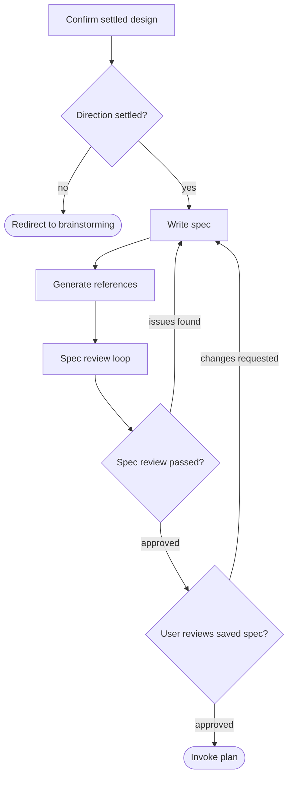

# Design Spec

Turn a settled design direction into a durable, reviewed spec artifact that is ready for implementation planning.

This skill captures and validates a chosen direction. It does not explore open trade-offs or invent the design inside the spec workflow. If the direction is still vague, unsettled, or tradeoff-heavy, use `brainstorming` first. If the direction is already clear and no spec is needed, use `plan` instead.

Default save path: `spec/spec-<slug>-YYYYMMDD.md`

User preferences for the spec location override this default.

## When To Use

Use this skill when a design needs to become a durable artifact:

- As a continuation of `brainstorming`, once the user has confirmed a direction
- When the user already has a clear idea and asks for a written, saved, reviewed, or approved spec
- When a decision is important enough to preserve even if conversation context is lost

Do not use this skill when:

- The direction is still unsettled or meaningful trade-offs have not been explored; use `brainstorming` first
- The implementation direction is already clear and no spec is needed; use `plan`

## Entry Points

This skill supports two entry points:

- Continuation: the design is already settled in the conversation, often from `brainstorming`. Confirm the settled design, then write the spec.
- Cold start: the user arrives with an already-clear idea. Do light context gathering, confirm scope, constraints, and success criteria, then write the spec.

If a cold start reveals that the direction is genuinely unsettled or tradeoff-heavy, stop and recommend `brainstorming` first. Do not invent a design here.

## Hard Gate

Once this skill is active, do NOT invoke `plan`, write implementation code, scaffold a project, or take implementation action until the spec has been written, reviewed, and approved by the user.

## Checklist

You MUST create a task for each of these items and complete them in order:

1. Confirm the settled design: from the conversation or via light context gathering on a cold start
2. Redirect to `brainstorming` if the direction is not settled
3. Write design spec: save to `spec/spec-<slug>-YYYYMMDD.md`
4. Invoke `reference-recorder` to generate a `## References` section
5. Spec review loop: dispatch a reviewer subagent using `references/spec-document-reviewer-prompt.md` with precisely crafted review context, never your session history; fix issues and re-dispatch until approved, max 5 iterations, then surface to a human
6. User reviews written spec: ask the user to review the saved spec file before proceeding
7. Transition to implementation: invoke `plan` to create the implementation plan

## Process Flow



The terminal state is invoking `plan`. Do NOT invoke any other implementation skill directly from `design-spec`.

## The Process

### Confirming the Settled Design

- Start from the best available source of truth: prior conversation, a confirmed brainstorming direction, an issue, a requirements doc, or a direct user request.
- Check relevant files, docs, and recent commits when the spec depends on an existing codebase.
- Restate the chosen direction and confirm it with the user before writing the spec.
- If the request describes multiple independent subsystems, flag this immediately.
- If the project is too large for a single spec, help the user decompose it into sub-projects. Each sub-project gets its own spec, plan, and implementation cycle.

### Redirecting When Needed

- If meaningful trade-offs remain open, stop and use `brainstorming` first.
- If the user does not want a durable spec and the implementation direction is clear, use `plan`.
- If the user asks for implementation before approving the saved spec, remind them that this workflow requires spec review and user approval first.

### Writing the Spec

- Once the user confirms the direction, save the approved design to `spec/spec-<slug>-YYYYMMDD.md`.
- User preferences for the spec location override this default.
- Do NOT commit the spec unless the user explicitly asks.
- Every saved spec MUST include a `## References` section generated by invoking the `reference-recorder` skill.

### Design for Isolation and Clarity

- Break the system into smaller units that each have one clear purpose, communicate through well-defined interfaces, and can be understood and tested independently.
- For each unit, answer what it does, how it is used, and what it depends on.
- If someone cannot understand what a unit does without reading its internals, the boundaries need work.
- Smaller, well-bounded units are easier to reason about and safer to edit.

### Working in Existing Codebases

- Explore the current structure before proposing changes.
- Where existing code has problems that affect the confirmed design, include targeted improvements in the spec.
- Do not propose unrelated refactoring. Stay focused on the current goal.

## Spec Structure

Use a structure like this and adapt the detail to the task:

````markdown
# [Feature Name] Design Spec

## Problem or Goal
[What problem this solves and why it matters]

## Context
[Relevant codebase, product, or operational context]

## Design Options

### Option 1: [Name]
[Description, trade-offs, and implications]

### Option 2: [Name]
[Description, trade-offs, and implications]

### Option 3: [Name]
[Description, trade-offs, and implications]

## Recommendation
[Which option is recommended and why]

## Scope and Non-Goals
- In scope: [What this spec covers]
- Out of scope: [What this spec intentionally excludes]

## Risks and Open Questions
- [Risk, assumption, or unresolved question]

## Validation Considerations
[How the design should be validated once implemented]

## References
[Generated via `reference-recorder`]
````

If design options were already explored in `brainstorming`, summarize the chosen direction and the rejected alternatives instead of re-deriving them.

## Spec Review

Spec review is mandatory for this skill.

After writing the spec and generating references:

1. Dispatch a reviewer subagent using `references/spec-document-reviewer-prompt.md`
2. If issues are found, fix the spec, regenerate references if needed, and re-dispatch until approved
3. If the loop exceeds 5 iterations, surface the problem to a human for guidance

## User Review Gate

After the spec review loop passes, ask the user to review the saved spec before proceeding:

> "Spec complete and saved to `<path>`. Please review it and let me know if you want to make any changes before we move on to the implementation plan."

Wait for the user's response. If they request changes, update the spec, re-run the spec review loop, and ask for review again. Only proceed once the user approves the saved spec.

## Implementation Handoff

- Invoke `plan` to create a detailed implementation plan.
- Do NOT invoke any other implementation skill. `plan` is the next step.

## Key Principles

- Settled design first: capture and validate a decided direction; do not explore open trade-offs here.
- Save durable artifacts only when the user asks for a formal spec or durable design record.
- Keep references explicit so the spec remains useful if conversation context is lost.
- Review before handoff: the saved spec must be reviewed and user-approved before transitioning to planning.
- Stay focused on the current goal.

## Diagrams

When visual explanation would help, use lightweight Mermaid diagrams directly in the spec document. Mermaid works well for architecture diagrams, flowcharts, and sequence diagrams, and it renders natively on GitHub. If a diagram is awkward to express in Mermaid, use an ASCII diagram instead.
